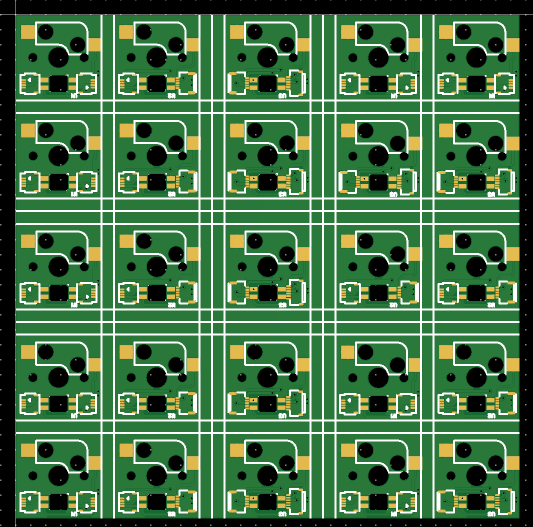

# 引言

嗨，这是一个使用了瀚文HelloWord固件的Dactyl人体工程学键盘，其继承了瀚文键盘的基本功能（按键、RGB灯效），支持热插拔，并使用了Dactyl生成器所生成的外壳。

为了最大程度适配瀚文固件所产生的一些设计，导致本项目的复刻难度可能较高，详细情况将在后续内容提及。

# 致谢、参考项目

非常感谢键盘爱好者的无私奉献，下面是本项目继承、参考的项目：

- [peng-zhihui-HelloWord-Keyboard](https://github.com/peng-zhihui/HelloWord-Keyboard)

  瀚文键盘

- [ibnuda-dactyl-keboard](https://github.com/ibnuda/dactyl-keyboard)

  dactyl外壳生成器

- [yejianfengblue-dactyl-generator-demo](https://github.com/yejianfengblue/dactyl-generator-demo)

  dactyl外壳生成器在各参数下的demo

# 文件结构

- 3Dmodel

  该目录下存放了3D模型文件，其中包括了dactyl外壳生成器的json配置文件、OpenSCAD源文件、用于固定PCB的SolidWorks工程文件以及最终导出，能够直接进行3D打印的STL文件。

- Firmware

  该目录下存放了修改后的瀚文键盘固件工程文件、固件（release文件夹下）。

- PCB

  该目录下存放了使用LCEDA绘制的PCB原理图、Layout，以及能够直接用于PCB制造的Gerber文件。

# 构建指南

## 电路构建

本项目的PCB一共包括三块：轴板（Keyboard），主控板（LeftBoard）、扩展板（RightBoard）。

由于Dactyl的异形结构（每个轴都不在一个平面上），按键轴的安装并不能用一块PCB完成。在其他的Dactyl项目中，轴与轴之间的连接通过手工飞线实现。

### 轴板

但为了继承瀚文键盘的大部分功能，使用飞线的方案可能导致较大的飞线数量，故本项目采用了每个按键使用单独一块PCB的方案。每块PCB上焊有RGB灯珠、轴座以及FPC排线连接座，PCB之间以及与主控板的连接通过FPC软排线实现。

为了节省打板费用，我将25个按键PCB拼板到了一个10x10cm的PCB上。

注意，这25个按键PCB并不是一样的，而是分为了3号PCB、2号PCB以及1号PCB。

对于1号PCB，其右边的FPC连接座为6P，从上至下的线序为（KEY1/KEY2/KEY3/GND/DIN/5V），而左边的FPC连接座为5P，从上至下的线序为（KEY2/KEY3/GND/DOUT/5V）。右边的6P座直接与主控连接，负责获取RGB灯珠的电源、信号以及传递按键连接。左边的5P座与2号PCB的5P座连接，将RGB电源、信号传递以及按键连接线的中继。

对于2号PCB，其右边的FPC连接座为5P，即与1号PCB相连。左边的FPC连接座为4P，从上至下的线序为（KEY2/KEY3/GND/DOUT/5V），与3号PCB相连。

对于3号PCB，其右边4P座与2号相连，左边的4P座定义为（GND/DOUT/DOUT/GND），即将RGB灯珠的输出信号传回至主控板。

1、2、3号PCB构成一个按键PCB组，由于RGB灯珠的信号是逐级传递的，故每个PCB组的3号PCB需要传回主控板，主控板再走线将信号输出至下一个PCB组的RGB信号输入。

每个PCB单元可以沿着白线使用铁皮剪剪开获得独立的PCB。

注意1：建议先进行剪裁再进行焊接，如果先焊接在剪裁的话可能会导致焊接在PCB上的元件损坏。

注意2：轴板的焊接工作量巨大，如果经济实力允许，建议使用SMT服务。

注意3：4P座的排线连接方向是反的，但不影响使用，如在意，可自行调整。

### 主控板

主控板的电路完全参考瀚文键盘，在移位寄存器的数量上进行了删减。其上一共有四个连接器：RJ45（负责给扩展板提供电源和传递信号）、Type-C（连接电脑）、SWD（程序下载接口）、UART（预留接口，可进行瀚文键盘其他功能的扩展）。

主控板被安装在左手键盘。

### 扩展板

扩展板上仅有移位寄存器、连接座以及LDO，其与主控板的连接通过RJ45实现。

注意：在USB连接上电脑前，需要保证主控板和扩展版的连接通畅，如果两块板之间的连接断开的话，由于单片机缺少移位寄存器的回传信号，会导致按键误判（表现为随机输出按键信息至电脑）。

## BOM
~~注意！LCEDA生成的BOM_Keybord中的器件数量是不对的。~~

~~…………~~

~~故实际的~~BOM_Keybord的元件数量为
- LED = 25
- SW = 25
- FPC_4P = 26
- FPC_5P = 16
- FPC_6P = 8

注意！这只是单张PCB（25个轴座）的BOM，本项目至少使用的PCB数量是3张（确切来说，需56个轴座），购买物料时记得买3倍的物料。

## 外壳构建

OpenSCAD文件夹：其内包括了Dactyl外壳的OpenSCAD源文件以及生成器的Json文件。将Json文件导入外壳生成器的网站可以加载我的设置并进行修改。

SolidWorks文件夹：其内包括了承载电路板的结构件。

STL文件夹：其内的STL文件可直接进行3D打印。

注意1：由于空间问题，承载电路板的结构件与外壳之间的卡口处需要打磨。

注意2：由于设计问题，两块电路板的底面需要是平整的，需要使用锉刀锉去凸起，否则无法安装仅承载电路板的结构件。

## 固件上传

通过STLINK或其他下载器，将Firmware>Release中的bin文件上传至STM32即可，若需要进行键位的修改，可自行编译HelloWord-keyborad-fw中的文件。

# 更新日志

2022-11-04：
readme基本完成，但还需要完善。
